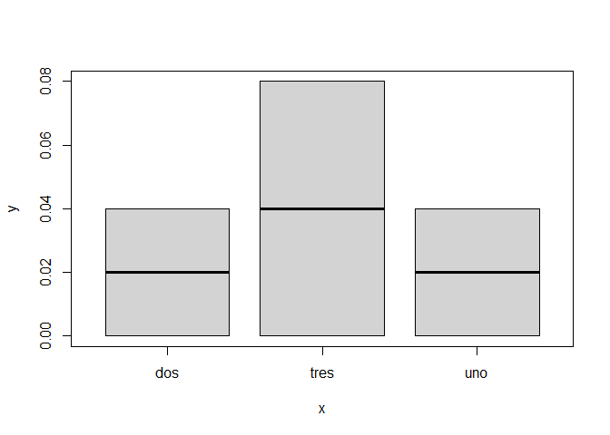
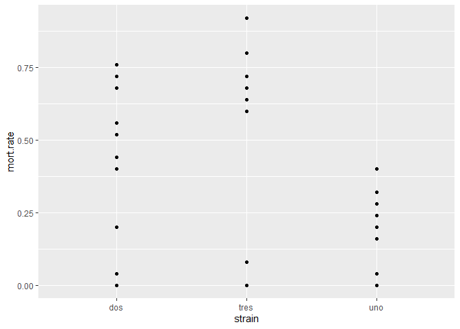
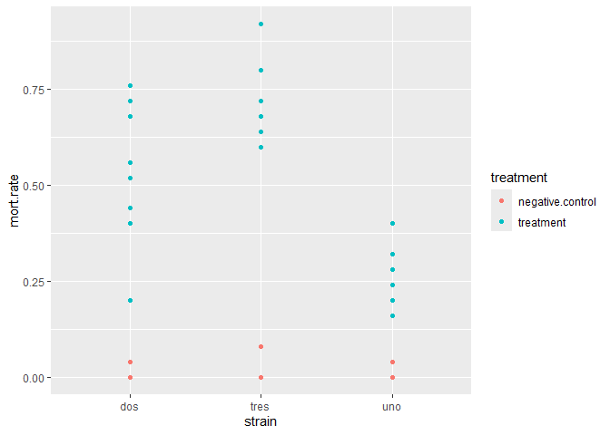
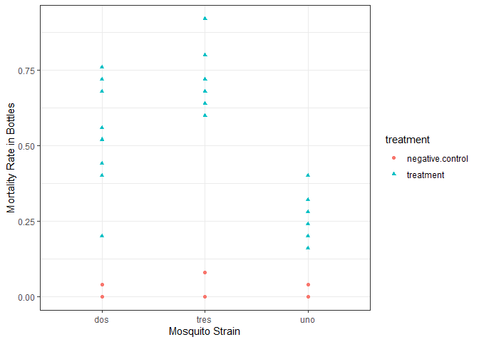
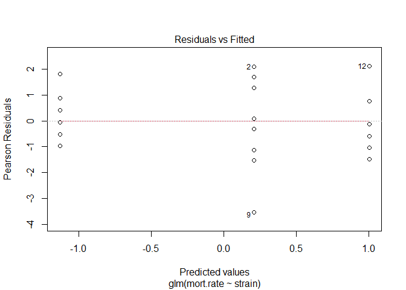
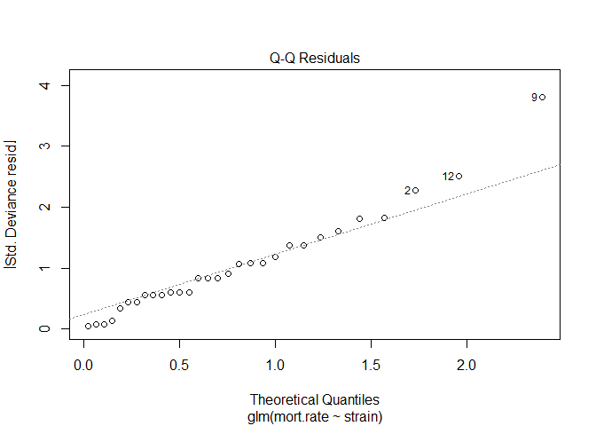
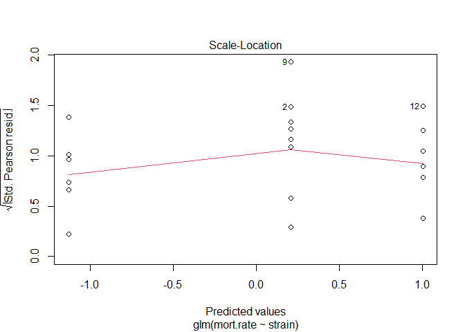
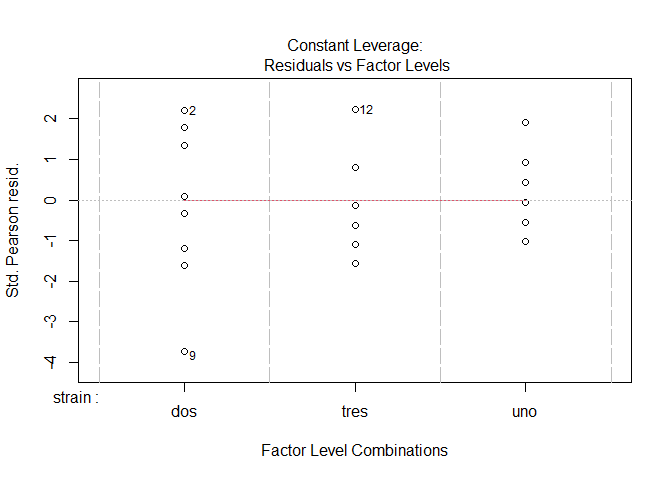

Testing for Mortality Differences in Three Strains of Insect
================
Dan Hartman
2025-03-21

## Objectives

1.  Understand the basics of plotting with ggplot()
2.  Use an example dataset to fit a binomial regression model.
3.  Use the model to get some information back about our dataset.

Take a minute to familiarize yourself with the script for todays meetup.
It’s long, but most of that is text to explain what is going on. Going
forward, there will be more code and fewer comments. The remainder of
this document is redundant with the comments in the R script provided,
in case you don’t want to toggle back and forth.

Also take a minute to look at the example dataset
(three.strain.mortality.csv). This represents three strains of insect,
in a situation where you are testing for differences in mortality. This
would be with a single insecticide, and with a uniform dose. I’m
imagining bottle assays here (thus the bottle column).

## The Workflow

These data were simulated, meaning that I chose the mortality rates for
each strain, and used some R code to generate bioassay results according
to those rates. So, there is naturally a little bit of noise. This
dataset is what you will read in to R.

The next step is to fit a model to those simulated data. Think of this
as drawing a line through those data points, just as you would with a
regular linear regression. This model is better specified to data that
we have, which are binomial rather than normal or Gaussian.

Finally, we can get some inference from the model output concerning
differences in mortality rates between the strains. Using the parameters
from the fitted model, we can back-estimate the mortality rates and
compare them to the ones we specified when we simulated the data. In an
experimental setting you won’t have the luxury of that prior
information, of course. These comparisons will serve as a sanity check,
and to show that we did the right things in our code.

## Excercise

### Get organized. Future-you will thank you.

Don’t forget to make a project folder. Put the example data set into
this folder, then the R script, then open the R script in RStudio. Take
a minute to set your working directory to this folder. You can do that
in the bottom-right window (Files tab), or like this (your path will
differ):

``` r
setwd("C:/Users/elvispresley/Documents/stats_project")
```

### Data Exploration

Now you are ready to read in the data and do some checks:

``` r
data <- read_csv("three.strain.mortality.csv")
```

    ## Rows: 36 Columns: 5
    ## ── Column specification ────────────────────────────────────────────────────────
    ## Delimiter: ","
    ## chr (2): treatment, strain
    ## dbl (3): bottle, dead, total.mosquitoes
    ## 
    ## ℹ Use `spec()` to retrieve the full column specification for this data.
    ## ℹ Specify the column types or set `show_col_types = FALSE` to quiet this message.

``` r
str(data) #This time we have double integers as well as character columns
```

    ## spc_tbl_ [36 × 5] (S3: spec_tbl_df/tbl_df/tbl/data.frame)
    ##  $ bottle          : num [1:36] 11 12 1 2 3 4 5 6 7 8 ...
    ##  $ treatment       : chr [1:36] "negative.control" "negative.control" "treatment" "treatment" ...
    ##  $ strain          : chr [1:36] "dos" "dos" "dos" "dos" ...
    ##  $ dead            : num [1:36] 0 1 14 19 11 13 17 17 10 18 ...
    ##  $ total.mosquitoes: num [1:36] 25 25 25 25 25 25 25 25 25 25 ...
    ##  - attr(*, "spec")=
    ##   .. cols(
    ##   ..   bottle = col_double(),
    ##   ..   treatment = col_character(),
    ##   ..   strain = col_character(),
    ##   ..   dead = col_double(),
    ##   ..   total.mosquitoes = col_double()
    ##   .. )
    ##  - attr(*, "problems")=<externalptr>

``` r
head(data) #Look at the top few rows of the table
```

    ## # A tibble: 6 × 5
    ##   bottle treatment        strain  dead total.mosquitoes
    ##    <dbl> <chr>            <chr>  <dbl>            <dbl>
    ## 1     11 negative.control dos        0               25
    ## 2     12 negative.control dos        1               25
    ## 3      1 treatment        dos       14               25
    ## 4      2 treatment        dos       19               25
    ## 5      3 treatment        dos       11               25
    ## 6      4 treatment        dos       13               25

Here is a data cleaning step:

``` r
unique(data$strain) #get the unique values for each strain
```

    ## [1] "dos"  "tres" "uno"

``` r
unique(data$treatment) #get unique bottle types
```

    ## [1] "negative.control" "treatment"

If we have any typos in the sheet, we will see them here and correct
them before going any further.

What are we missing? Mortality rates of course! Lets calculate those.
mutate() can add a column calculated from other columns.

``` r
data<-mutate(data, mort.rate=dead/total.mosquitoes) #we are overwriting "data"
head(data)
```

    ## # A tibble: 6 × 6
    ##   bottle treatment        strain  dead total.mosquitoes mort.rate
    ##    <dbl> <chr>            <chr>  <dbl>            <dbl>     <dbl>
    ## 1     11 negative.control dos        0               25      0   
    ## 2     12 negative.control dos        1               25      0.04
    ## 3      1 treatment        dos       14               25      0.56
    ## 4      2 treatment        dos       19               25      0.76
    ## 5      3 treatment        dos       11               25      0.44
    ## 6      4 treatment        dos       13               25      0.52

How to look at only negative controls? This is called subsetting, or
filtering. Great data exploration tool. There are ways with base R, but
tidyverse makes this a lot easier for us.

``` r
filter(data, treatment=="negative.control")
```

    ## # A tibble: 6 × 6
    ##   bottle treatment        strain  dead total.mosquitoes mort.rate
    ##    <dbl> <chr>            <chr>  <dbl>            <dbl>     <dbl>
    ## 1     11 negative.control dos        0               25      0   
    ## 2     12 negative.control dos        1               25      0.04
    ## 3     11 negative.control tres       0               25      0   
    ## 4     12 negative.control tres       2               25      0.08
    ## 5     11 negative.control uno        0               25      0   
    ## 6     12 negative.control uno        1               25      0.04

Notice the double “=”. this is necessary for logical equations. Great,
low mortality in control bottles. Not bad!

An equivalent way of filtering for negative control bottles:

``` r
data %>% filter(treatment=="negative.control")
```

    ## # A tibble: 6 × 6
    ##   bottle treatment        strain  dead total.mosquitoes mort.rate
    ##    <dbl> <chr>            <chr>  <dbl>            <dbl>     <dbl>
    ## 1     11 negative.control dos        0               25      0   
    ## 2     12 negative.control dos        1               25      0.04
    ## 3     11 negative.control tres       0               25      0   
    ## 4     12 negative.control tres       2               25      0.08
    ## 5     11 negative.control uno        0               25      0   
    ## 6     12 negative.control uno        1               25      0.04

The %\>% takes the data and passes it through one or several steps of
manipulation.

We can also have multiple filtering criteria:

``` r
data %>% filter(treatment=="negative.control", strain=="dos")
```

    ## # A tibble: 2 × 6
    ##   bottle treatment        strain  dead total.mosquitoes mort.rate
    ##    <dbl> <chr>            <chr>  <dbl>            <dbl>     <dbl>
    ## 1     11 negative.control dos        0               25      0   
    ## 2     12 negative.control dos        1               25      0.04

Let’s make a quick plot of the negative control bottles using base R:

``` r
neg.bottles<-data %>% filter(treatment=="negative.control")
plot(y=neg.bottles$mort.rate, x=as.factor(neg.bottles$strain), type="p")
```

<!-- -->

It works, but I don’t like it. Let’s get some better plotting going with
ggplot. This graphics package loads automatically with tidyverse, so we
are good to go.

``` r
ggplot(data=data) +
  geom_point(aes(x=strain, y=mort.rate)) #aes() is for "aesthetics"
```

<!-- -->

That’s cool, but how do we distinguish between treated and negative
control bottles?

``` r
ggplot(data=data) +
  geom_point(aes(x=strain, y=mort.rate, color=treatment))
```

<!-- -->

Better - but it’s best practice to use symbols in addition to colors, in
case this gets printed in black and white, or for colorblind folks. And,
our axes come from the column names - so let’s fix those axis labels.
And a different theme, or style:

``` r
ggplot(data=data) +
  geom_point(aes(x=strain, y=mort.rate, color=treatment, shape = treatment)) +
  ylab("Mortality Rate in Bottles") +
  xlab("Mosquito Strain") +
  theme_bw()
```

<!-- -->

Nice, clean, and readable.

### Hypothesis Testing

It looks like we might have some differences in mortality rates. Who
knew. We are ready for our hypothesis test. We can use a binomial
regression for this.

Our negative control bottles won’t go into this, so we can filter them
out. They were mostly there in order to make sure our assays went well,
and that we didn’t need to make a correction.

``` r
glm(mort.rate ~ strain, #Formula, as response.variable ~ explanatory variable.
  weights = total.mosquitoes, #The total number of mosquitoes in each bottle
  data=data %>% filter(treatment=="treatment"), #dataset without NC bottles
  family=binomial) #binomial regression, since these are mortality data.
```

    ## 
    ## Call:  glm(formula = mort.rate ~ strain, family = binomial, data = data %>% 
    ##     filter(treatment == "treatment"), weights = total.mosquitoes)
    ## 
    ## Coefficients:
    ## (Intercept)   straintres    strainuno  
    ##      0.2088       0.7960      -1.3396  
    ## 
    ## Degrees of Freedom: 29 Total (i.e. Null);  27 Residual
    ## Null Deviance:       173.5 
    ## Residual Deviance: 46.38     AIC: 155.2

If this is all we do, the function gives output for the fitted
coefficients and intercept. Let’s create an object, to make some other
stuff easier.

``` r
model.fit <- glm(mort.rate ~ strain,
    weights = total.mosquitoes,
    data=data %>% filter(treatment=="treatment"),
    family=binomial)
```

We can make some handy plots to see how well our model fit. Yours will
never look this nice, be forwarned! We simulated this data, so it’s
pretty synthetic, and if these didn’t look nice I’d really worry that we
chose the wrong type of model. Enter this, then hit enter to keep seeing
additional plots. I usually focus on the Q-Q plot and the residual plot.

``` r
plot(model.fit)
```

<!-- --><!-- --><!-- --><!-- -->

This will give you a summary of your model, and some p-values - these
can use different tests by default, depending on the type of model. See
?summary.glm()

``` r
summary(model.fit)
```

    ## 
    ## Call:
    ## glm(formula = mort.rate ~ strain, family = binomial, data = data %>% 
    ##     filter(treatment == "treatment"), weights = total.mosquitoes)
    ## 
    ## Coefficients:
    ##             Estimate Std. Error z value Pr(>|z|)    
    ## (Intercept)   0.2088     0.1272   1.641    0.101    
    ## straintres    0.7960     0.1912   4.163 3.14e-05 ***
    ## strainuno    -1.3396     0.1946  -6.885 5.78e-12 ***
    ## ---
    ## Signif. codes:  0 '***' 0.001 '**' 0.01 '*' 0.05 '.' 0.1 ' ' 1
    ## 
    ## (Dispersion parameter for binomial family taken to be 1)
    ## 
    ##     Null deviance: 173.524  on 29  degrees of freedom
    ## Residual deviance:  46.383  on 27  degrees of freedom
    ## AIC: 155.22
    ## 
    ## Number of Fisher Scoring iterations: 4

Great - we have data (points), and then fit a line through those points
(our model). These coefficients and intercept describe that line.

``` r
model.fit
```

    ## 
    ## Call:  glm(formula = mort.rate ~ strain, family = binomial, data = data %>% 
    ##     filter(treatment == "treatment"), weights = total.mosquitoes)
    ## 
    ## Coefficients:
    ## (Intercept)   straintres    strainuno  
    ##      0.2088       0.7960      -1.3396  
    ## 
    ## Degrees of Freedom: 29 Total (i.e. Null);  27 Residual
    ## Null Deviance:       173.5 
    ## Residual Deviance: 46.38     AIC: 155.2

Why do we only have coefficients for two of our strains? The short
answer is, the model uses one factor as “reference” factor, fixing it at
0. Check the signs - the positive coefficient for “tres” means that tres
has higher mortality than the reference level (dos, chosen
automatically). Coefficient “uno” has a negative sign, meaning that it
has lower mortality than dos. We can think of the intercept as the
reference strain here (dos).

### Model Checking

So with these values, we get some predictive power. We can use this
handy function to back-calculate the predicted means for each strain,
using the intercept and coefficients from our model:

``` r
emmeans(model.fit, ~ ".",
        type="response",
        weights = data$total.mosquitoes,
        adjust=TRUE)
```

    ##  strain  prob     SE  df asymp.LCL asymp.UCL
    ##  dos    0.552 0.0315 Inf     0.476     0.626
    ##  tres   0.732 0.0280 Inf     0.660     0.794
    ##  uno    0.244 0.0272 Inf     0.185     0.315
    ## 
    ## Confidence level used: 0.95 
    ## Conf-level adjustment: bonferroni method for 3 estimates 
    ## Intervals are back-transformed from the logit scale

We simulated these data with each strain having a different mortality
rate. Those were uno-0.25, dos-0.50, tres-0.75. Compare those with the
output of emmeans (prob column). Look at the lower and upper confidence
limits to see what our margin of error is. Not bad for just 10 treatment
bottles in each group. We can treat non-overlap of these confidence
intervals as our hypothesis test.

When your experimental design gets a bit more complex, multiple doses,
observation periods, etc. - we can use predict() to get estimates of
mortality from specific sets of conditions. I’ll save that for when we
do LC50’s.
