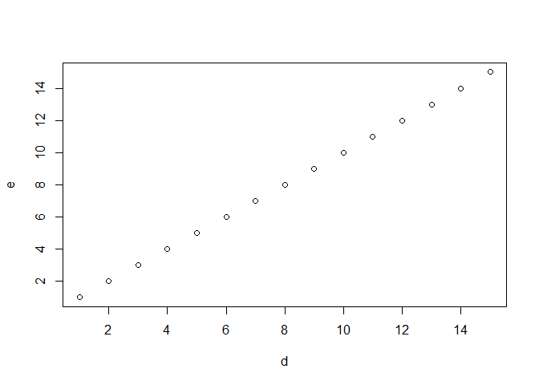
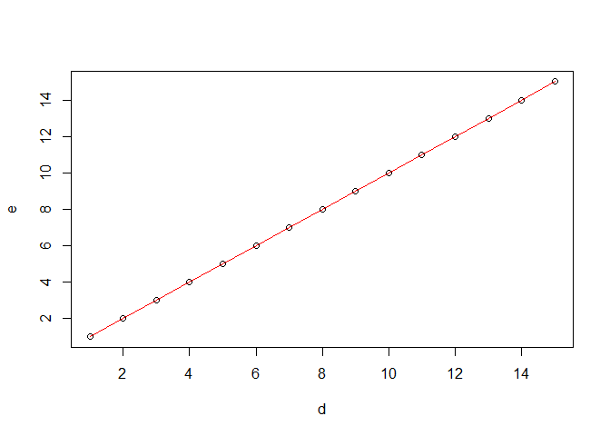
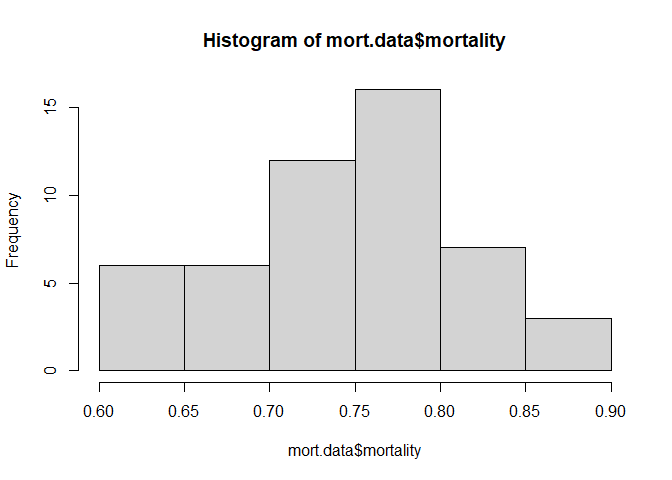

Getting Started with R
================
Dan Hartman
2025-03-21

## Objectives for this meeting:

1.  Installing R and RStudio. What is an IDE?
2.  Using the console and creating a script.
3.  What packages are, and how to install them.
4.  How to pull up the help documentation for a function.
5.  Data structures
6.  Reading in the data and performing some basic checks.

## Installation

If you’re starting from scratch on your computer, you can download R
[here](https://cran.r-project.org/). Once you have R, you can get
RStudio [here](https://posit.co/download/rstudio-desktop/).

That’s it! Well, for now. Think of R as our workshop, with a toolbox,
and some very basic tools. R is the ‘environment’. By adding packages
(tools), we can turn this environment into a wood shop, barber shop, art
studio, etc. depending on how we curate our toolset. More on that in a
minute. Let’s get into the environment.

## Poking Around

Go ahead and open RStudio. You’ll probably see 4 mostly empty windows.
You can click and drag the edges of these windows around to suit your
task. For now, lets make the bottom left window bigger. This is the
console.

### The Console

The console tab is interactive. This is where we enter commands. Let’s
try a few:

``` r
print("Welcome to R")
```

    ## [1] "Welcome to R"

We asked R to print the statement “Welcome to R”, and it did. This is
the typical structure of a console command - print is the function, and
“Welcome to R” is the argument. Functions typically need some sort of
input, these are provided in the form of arguments.

Let’s enter some commands to the console to install a few packages, and
start outfitting our shop with some tools.

``` r
install.packages("tidyverse")
```

We just installed the Tidyverse, which is a nice collection of tools
that all work very well together. This will help us manipulate any data
that we import, and also make pretty plots.

before we use any of the handy tools that tidyverse gives us, we have to
load them (take them out of our toolbox and put them on the bench, say).
We do this with the library function, which takes the package as it’s
argument.

``` r
library(tidyverse)
```

    ## Warning: package 'ggplot2' was built under R version 4.4.3

    ## ── Attaching core tidyverse packages ──────────────────────── tidyverse 2.0.0 ──
    ## ✔ dplyr     1.1.4     ✔ readr     2.1.5
    ## ✔ forcats   1.0.0     ✔ stringr   1.5.1
    ## ✔ ggplot2   3.5.1     ✔ tibble    3.2.1
    ## ✔ lubridate 1.9.3     ✔ tidyr     1.3.1
    ## ✔ purrr     1.0.2     
    ## ── Conflicts ────────────────────────────────────────── tidyverse_conflicts() ──
    ## ✖ dplyr::filter() masks stats::filter()
    ## ✖ dplyr::lag()    masks stats::lag()
    ## ℹ Use the conflicted package (<http://conflicted.r-lib.org/>) to force all conflicts to become errors

So we have tidyverse loaded now. To see what tidyverse has to offer, we
can enter our help command or “?”. We can do this before any package or
function to get the official documentation. This will come up in the
bottom-right hand window.

``` r
?tidyverse
```

    ## starting httpd help server ... done

We will continue to customize our environment depending on what we plan
on working on, keeping our space clean of things we don’t need. We won’t
be loading much from the console. We can make a script in our source
window to automate this for each specific project. This is done in the
top-right window (source window).

### Making a script

The source window is where you write your code. This is where you make
most of the edits during analyses. Commands will be written here, and R
will execute them from top to bottom. At the top of each script, we will
typically be loading all of the packages that we need using the
“library” function. So, my scripts usually look something like this:

``` r
rm(list = ls())  #clear our environment
library(tidyverse) #manipulate and visualize data
library(brms)  #fit fancy models
library(modelr)  #make predictions from the fancy models
```

In a script, we can enter text after \#, and R will ignore it. this is
called a ‘comment’. We can use these to add human-readable descriptions
of what parts of the script do. This is pretty important for sharing
scripts with other people, or helping our future selves remember what we
were doing when we made them.

Don’t worry about the rm() in the first line, we will come back to that
in a minute. Let’s go back to the bottom-left console window for a few
minutes.

### Math Fun

R is made specifically for statistics, and it’s great at it. The core
functions of R (the base library) are statistical and mathematical
functions, so R is ready to do many analyses right out of the box. Let’s
start entering some basic commands:

``` r
4+4
```

    ## [1] 8

``` r
2^2
```

    ## [1] 4

Pretty intuitive, not very scary. R is “object-oriented” meaning that we
can store values, datasets, plots, etc. as objects within the
environment.

``` r
a=4+4
b=2^2
c=a+b
print(c)
```

    ## [1] 12

Here we made the variables a, b, and c which depends on a and b.
Changing either a or b will automatically change c (give it a try). We
can also see that these variables are now included in the top-right
window, which shows which objects are in our environment. These are
single values (scalars), but we can also have vectors. There are more
than 1 way to make the same vector:

``` r
#make a few vectors using c() for "concatenate"
d=c(1,2,3,4,5,6,7,8,9,10,11,12,13,14,15)
e=c(1:15)
setequal(d,e) #determine if we have equal sets
```

    ## [1] TRUE

Remember the rm(list=ls()) command above? “list” is an argument that
rm() uses to determine what to remove. ls() lists all of the objects in
the environment, and this is passed to rm() which deletes the output of
ls(). We can do this in a few steps as well:

``` r
ls() #show what's in our environment
```

    ## [1] "a" "b" "c" "d" "e"

``` r
list=ls() #make a list of everything in the environment
rm(list=list) #pass that list to the 'delete' function
```

Now we have an empty environment. But this was the first thing in our
script… Why are we deleting everything in our environment, before we’ve
done anything? We want to make sure that our whole script works well
from top-to-bottom, starting with an empty environment. If we re-ran the
script without this line, we would have some junk objects from previous
runs in our environment. This is just good practice and bug prevention.

## Plotting

Base R has some plotting functions that are useful for quick-and-dirty
data exploration:

``` r
d=c(1:15)
e=c(1:15)
plot(d,e)
```

<!-- -->

Hopefully you saw that come up in the bottom-right window. This plotted
a dot plot by default. Let’s make it marginally more interesting, and
add a red line:

``` r
plot(d,e) #plot the dots
lines(d,e, col="red") #add lines
```

<!-- -->

Not bad for two lines of code. That’s what’s nice about the base
functions for plotting - very easy and quick looks at the data. It’s not
going to win you friends or scare your enemies, though. Next time we
will use a powerful set of tools that make publication-quality plots,
while incorporating summary statistics pretty seamlessly.

## Data Structures

One of the things that R is picky about is data structures. You can
think of this as a sort of “format”. Let’s revisit the vectors we made
before:

``` r
d
```

    ##  [1]  1  2  3  4  5  6  7  8  9 10 11 12 13 14 15

``` r
e
```

    ##  [1]  1  2  3  4  5  6  7  8  9 10 11 12 13 14 15

This look the same - and above when we ran setequal() on them, we got
“TRUE”, meaning that these are equal sets. But, they aren’t identical.
We can use a more rigorous command to see if these are identical objects
(as opposed to sets of numbers).

``` r
identical(d,e)
```

    ## [1] TRUE

You might have noticed before in the environment window that d has a
“num” label and e has “int” label. That means that d is “numeric” while
e is “integer”. So they are the same set of numbers, but they have
different structures. Numeric can include any value on the number line,
while integers are only whole numbers. Luckily, we can convert formats
pretty easily:

``` r
as.integer(d)
```

    ##  [1]  1  2  3  4  5  6  7  8  9 10 11 12 13 14 15

``` r
as.numeric(e)
```

    ##  [1]  1  2  3  4  5  6  7  8  9 10 11 12 13 14 15

``` r
identical(d, as.numeric(e))
```

    ## [1] FALSE

One of the most common errors occurs when we pass data to a function in
a format/structure other than what it is designed for.

## Reading in data

There are lots and lots of ways to read (import) data into your
environment. The easiest way is to save data as a .csv file in excel,
then use either read.csv() (base R) or read_csv() from the Tidyverse
package of tools. I like the flexibility of the latter.

First, we need to tell R where our data is stored. A good practice is to
set the working directory to our project folder - I put this at the top
of the script, after loading libraries. For the first time, You can use
the “files” tab in the bottom right, navigate to your project folder,
click the gear button, then “set as working directory”. You’ll see a
setwd() command automatically entered into your console - this can be
copied and pasted into your script so that this happens automatically
going forward. You can use the “?” to see what this does.

``` r
?setwd()
?getwd()
getwd()
```

    ## [1] "C:/Users/hartm/OneDrive/Documents/bioassay_analysis_workshop/Meeting_1"

This is my working directory - your’s will be different. Now put the
example dataset, mortality.csv into this folder, and you should be able
to see it in your files tab. Go ahead and read it in using read_csv():

``` r
mort.data<-read_csv("mortality.csv") #read the data in and store as "mort.data" object
```

    ## New names:
    ## Rows: 50 Columns: 4
    ## ── Column specification
    ## ──────────────────────────────────────────────────────── Delimiter: "," dbl
    ## (4): ...1, bottle, dead, mortality
    ## ℹ Use `spec()` to retrieve the full column specification for this data. ℹ
    ## Specify the column types or set `show_col_types = FALSE` to quiet this message.
    ## • `` -> `...1`

Since data structures are important, let’s inspect to make sure the data
look good, and formats make sense. Use the “?” to see what each of these
functions do.

``` r
head(mort.data)
```

    ## # A tibble: 6 × 4
    ##    ...1 bottle  dead mortality
    ##   <dbl>  <dbl> <dbl>     <dbl>
    ## 1     1      1    18      0.72
    ## 2     2      2    19      0.76
    ## 3     3      3    20      0.8 
    ## 4     4      4    17      0.68
    ## 5     5      5    20      0.8 
    ## 6     6      6    21      0.84

``` r
spec(mort.data)
```

    ## cols(
    ##   ...1 = col_double(),
    ##   bottle = col_double(),
    ##   dead = col_double(),
    ##   mortality = col_double()
    ## )

``` r
str(mort.data)
```

    ## spc_tbl_ [50 × 4] (S3: spec_tbl_df/tbl_df/tbl/data.frame)
    ##  $ ...1     : num [1:50] 1 2 3 4 5 6 7 8 9 10 ...
    ##  $ bottle   : num [1:50] 1 2 3 4 5 6 7 8 9 10 ...
    ##  $ dead     : num [1:50] 18 19 20 17 20 21 16 19 21 18 ...
    ##  $ mortality: num [1:50] 0.72 0.76 0.8 0.68 0.8 0.84 0.64 0.76 0.84 0.72 ...
    ##  - attr(*, "spec")=
    ##   .. cols(
    ##   ..   ...1 = col_double(),
    ##   ..   bottle = col_double(),
    ##   ..   dead = col_double(),
    ##   ..   mortality = col_double()
    ##   .. )
    ##  - attr(*, "problems")=<externalptr>

``` r
tail(mort.data)
```

    ## # A tibble: 6 × 4
    ##    ...1 bottle  dead mortality
    ##   <dbl>  <dbl> <dbl>     <dbl>
    ## 1    45     45    20      0.8 
    ## 2    46     46    22      0.88
    ## 3    47     47    19      0.76
    ## 4    48     48    19      0.76
    ## 5    49     49    18      0.72
    ## 6    50     50    18      0.72

``` r
dim(mort.data)
```

    ## [1] 50  4

These are all good information… Each column was read as a double
integer, which means we can have decimals. Note that we do have a number
of integers here - we would need to convert these before certain
analyses (i.e. most analyses of count data or survival data).

A few other checks are good to visualize our data. Histograms are
probably the best first glance at the data. To look at a specific column
of data we can use the format object\$name or object\[,col#\].

``` r
mort.data$mortality
```

    ##  [1] 0.72 0.76 0.80 0.68 0.80 0.84 0.64 0.76 0.84 0.72 0.68 0.76 0.72 0.72 0.76
    ## [16] 0.76 0.88 0.80 0.72 0.72 0.80 0.84 0.72 0.68 0.84 0.72 0.80 0.88 0.68 0.68
    ## [31] 0.76 0.76 0.64 0.68 0.84 0.72 0.60 0.84 0.72 0.64 0.60 0.60 0.76 0.84 0.80
    ## [46] 0.88 0.76 0.76 0.72 0.72

``` r
mort.data[,4]
```

    ## # A tibble: 50 × 1
    ##    mortality
    ##        <dbl>
    ##  1      0.72
    ##  2      0.76
    ##  3      0.8 
    ##  4      0.68
    ##  5      0.8 
    ##  6      0.84
    ##  7      0.64
    ##  8      0.76
    ##  9      0.84
    ## 10      0.72
    ## # ℹ 40 more rows

``` r
hist(mort.data$mortality)
```

<!-- -->

We can see that most bottles had a mortality rate (proportion) of around
.75, but going as low as .6 or .9 (ish).
